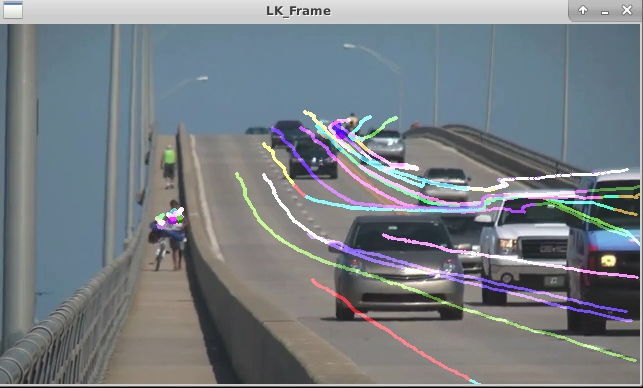

对应博客：https://blog.csdn.net/u011341856/article/details/102408063?spm=1001.2014.3001.5501

## How to use?

Enter the root directory of the current file, then open terminal!

``mkdir build``

``cd build``

``cmake ..``

``make ``

## 01 LK
```
wget https://www.bogotobogo.com/python/OpenCV_Python/images/mean_shift_tracking/slow_traffic_small.mp4
./LKOpticalFlow
```

`ubuntu@acd4ed39dee8:~/Dev/docker/u18_cuda/LoveChina/scripts/OpenCV$ python lkflow.py `



```
sudo apt install -y ros-noetic-pcl-ros ros-noetic-velodyne-msgs libopencv-dev libgoogle-glog-dev libeigen3-dev libsuitesparse-dev libpcl-dev libyaml-cpp-dev libbtbb-dev libgmock-dev 
sudo apt install libcanberra-gtk-module
```

编译g2o到make即可
编译Pangolin到make即可
